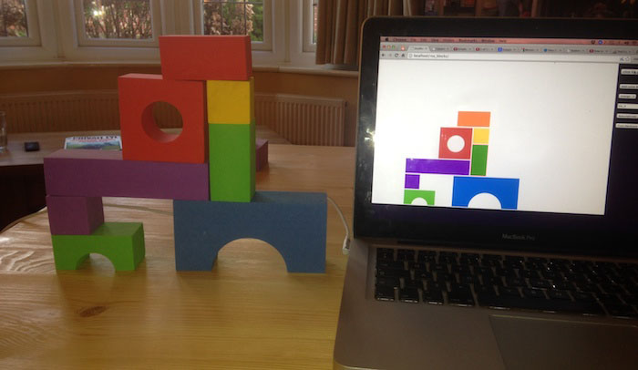

As part of my dissertation I need to create a file-format (probablly XML
based) for storing the position of blocks, in the final tower. I had
originally planned to just make the file format, but It seemed silly not to
make a GUI to allow me to quickly test the format is correctly loadable and
editable. Anyway... 10 hours, 4 cups of coffee and 3 diet cokes later, I have
come up with something that im "Quite pleased with"

<iframe width="700" height="430" src="https://www.youtube.com/embed/IWIiXn-mtfs" frameborder="0" allowfullscreen></iframe>

## What does it do?

At this point I havent actually even written the file-format. This is a 100%
JS, and CSS (HTML) application, that allows me to position blocks, drag and
drop them around and then "simulate" to see if they would fall over. I Plan to
write the file-format later this week (maybe today), and Ill post the nex link
here, once im done! note:: EDIT: I did it! I wrote the file-format loader, and
Updated the software to allow saving and loading of blocks via a XML file, its
rough, but it works!

#### The blocks are based on the real blocks that I own,

and you will have to trust me when I say its really a great simulator. If a
block "falls" in the simulator, It means it will fall in real life. It doenst
"topple, or wobble" in the simulator, It just falls straight down. No point in
extra code thats not needed, Its just nice to be able to check if a tower will
actually stay upright! Oh!, and the software /is/ correct. It doesnt allow you
to compensate for weight, because the robot builds one block at a time.

## Can I play with it?

[Yes! Just Click this amazing link!](http://calumk.com/dissertation)

## What does it need/use?

It is ONLY TESTED in chrome, It Might work in others, probably not IE. Not my
fault, IE is crap. \-- SAVING ONLY WORKS IN CHROME -- It is built ontop of
jQuery, and jQueryUI for the dragging/dropping. Is is NOT a plugin. Its a
static site, It is not an "easy-to-impliment" into anything kind of thing...

## Can I have the code?

[Yes! Its probably really buggy, but here you go](ros_blocks.zip)

