In my [Last](/blog/OpenCV - Recognizing Letterboxes) post on OpenCV I looked
at expanding the squares.cpp example and used filtering to detect letterboxes
in photos / video. Since then I have re-clarified the goal of my dissertation,
and have decided to attempt a 'slightly' different project.

##  Baxter

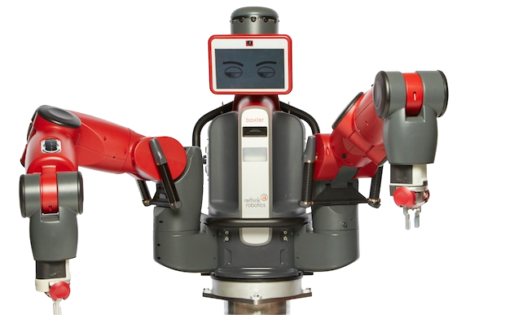 

I've been lucky enough to have been given the opportunity
to use a brand new baxter robot. Middlesex was given a demo of the Baxter last
week, with a view that the University might purchase one towards the end of
the year. luckily, after a short discussion with my tutors, we were able to
bring the purchase forward a few months so that I (and one other) could use it
for a final year project. After writing the letterbox code in less than 24
hours, I felt I might want to attempt something more complex, as plotting the
letterbox to XY and moving baxters arms to a location, would be a fairly
trivial task.

##  New Project Goal

My new project is going to be based on "blocks" After playing with the blocks
used for the CRS Robot [Get them from
Toys'R'Us](http://www.toysrus.co.uk/\(0079148\)) I wanted to see if I could go
a step further. My new project is based on the concept of human/robot co-
operation. 

####I'm going to challenge Baxter, to 'duplicate' any tower I make out of the blocks

## Defining Goals

Its important to set out the goals that I hope to achieve. I am going to aim
to complete this project in 3 sections: 1) A data structure (file) for storing
the Position, Orientation, and Colour (UK Spelling) of blocks in a tower. 2)
An OpenCV (or similar) software package, for recognizing and encoding physical
towers into the data structure (file) 3) A Ros package? Or Python script for
ROS, that controls the baxter robot, to build the tower specified in the data
structure (file) Extra Goals: 4) A GUI for designing / visualizing towers,
without the need for physical blocks, that saves into the same data structure
(file) Current Unknowns: Will The building blocks for constructing the tower,
be in "pre-defined positions" or will they be "found" by baxter? I think I
will leave this till last. EG: I will start with "pre-defined positions" for
the blocks, and will work up to "search" if I have time. It will not be a Goal
of the project, but will be added if time is permitting

## Defining Towers

I feel its important to clarify what I mean by 'tower' and lay out some rules
for tower building. These rules are not meant to restrict the project, and
every attempt will be made to "exceed" the restrictions, but a realistic
analysis of what towers can be is necessary 1) The towers will be one block
wide, that is, every block should be fully visible to baxter, and the blocks
should be representable on an XY graph with No Z axis. (think tetris) 2) Each
block in the tower must be orientated so it is uniquely identifiable from the
side closest to baxter. Take a look at the following 2 photographs. Both
towers contain the exact same blocks, however in one of the photographs it is
impossible to tell if the green block is a triangle or a rectangle. I propose
that all my blocks will have their "feature face" presented towards baxter, so
they are uniquely identifiable. 

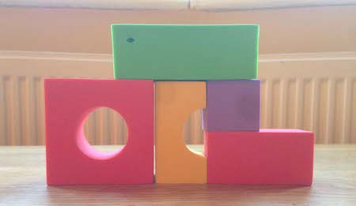
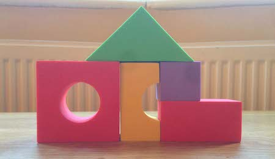  

####My 1 year old nephew, Oscar, really likes this tower

## Programmers are tools for converting caffeine into code.

Right back to the nitty gritty code stuff! So in my last post I talked about
the [squares.cpp](https://code.ros.org/trac/opencv/browser/trunk/opencv/samples/cpp/squares.cpp?rev=4079) example and how it can be used, and once again I
surfed the internet and found that the incredibly talented Nashruddin Amin has
done something similar to start me off: [Detecting simple shapes in an
image](https://opencv-code.com/tutorials/detecting-simple-shapes-in-an-image/)
I've mirrored it here. Just in case: 
[Mirror](/detecting-simple-shapes-in-an-image/) 

*	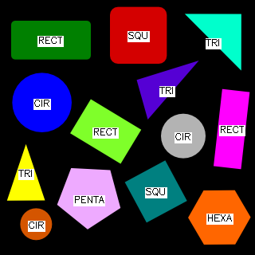
*	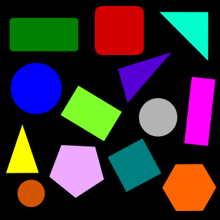

While the work Nashruddin has done is a
good staring point, it is by no means a complete solution. It is based
entirely on "flat, 2D, single colour, computer-generated' images, and is
unsuitable for many of the shapes in my "blockset", that contain holes, gaps
or "indents". I ran Amins code over the example pictures I provided above,
Just to see the result. I got NOTHING. it didn't even find a single shape, of
course I didn't expect it to, Its not designed to. If we compare the 2 images
after they have undergone a black and white conversion and an "edge
recognition" phase, we can see why: 

*	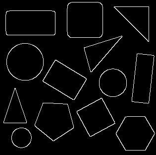
*	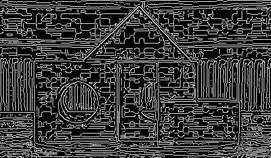

####It looks more like a maze than a tower...

Of course We had the same issue in my last post, so how did we overcome this for the square detection? surely that would work? A quick pass of my photo through the square finding example from last week and we see: 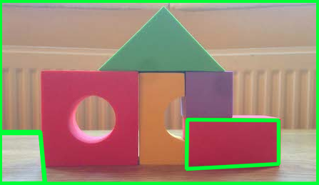 We found one of the shapes, its a
rectangle! Woo go us! So why didn't Nashruddin's code find any of thoes
rectangles? The original squares.cpp example uses a couple of awsome tricks
that are not in Nash's example

This helps a little to reduce noise, but there are still no shapes found, the major issue seems to
be that Nash's code doesnt look for different shapes along the colour
spectrum. Its going to be easier to impliment nash's IDEAS back into the
squares.cpp example, instead of the squares.cpp ideas into Nash's code.

## Genesis

In the beginning God created the heavens and the earth, and squares.cpp My
code is going to get messier, before it gets cleaner so buckle up. Step one,
is to try and find that big old triangle at the top. I start by adding a
cv:Mat Vactor named 'triangles' to all my search and display functions. Then
in the find section we add this stupidly simple code:

Basically one line functionally different code
and we can see our triangles:

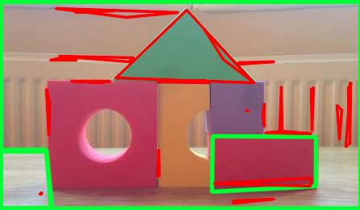 

Now we just need to filter. This is really easy logic, because we know our angle size for this
triangle. so we can just compare. I wrote a function to get me the actual
angle in degrees of each corner of a triangle, because the original code gives
me it in cosine, which while quicker, drives me crazy

Couple that with math to ensure we have an good
Triangle with all corners > 35 degrees, and at least one size bigger than 30px (random threshold) 

and we get:
 
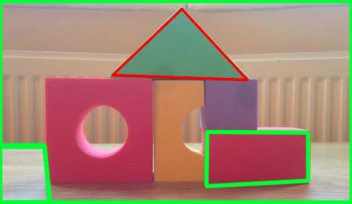 

It occurs to me I should have removed the outliers earlier. Ill quickly add in the Outliers code I wrote in my last post. 

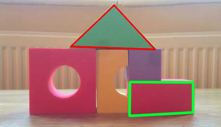

####Cillit bang. Bang! and the dirt is gone

## So about those odd shapes

So now to move onto those quite frankly weird shapes with holes in and all
that jazz. There are a couple of issues to solve: 1) why didn't the code find
the big red square with the hole in and identify it as a square? 2) why didn't
the code find the purple square?? 2) how do you find that yellow thing with
the chunk missing?

