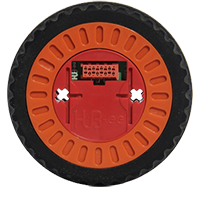

I have absolutly no idea if this code works, but I had a spare hour this-
morning and decided to write some funtions for the hub-ee wheels. I've never
actually used them myself, but several students at my university are using
them, so I thaught I would help them out a bit by providing them with a couple
of extra functions to get started.   *No Cheating!* If nothing else the
math / concepts are certianly correct, and could really be ported to any
system. They are incredibly similar (but cleaner) to functions i've used in
the past with the [EMG30 / MD25](http://www.robot-
electronics.co.uk/acatalog/Drive_Systems.html) set For thoes who dont know,
the Hub-ee Wheels can be purchased from [www.creative-robotics.com](http://www
.creative-robotics.com) or from [Sparkfun](sparkfun) They are little wheels
with built in encoders and motors. Not super powerful or accurate, but they
seem to be pretty reliable.

Here we go! It requires the standard Hub-ee Library.

##  Just my extra functions

##  Full code

