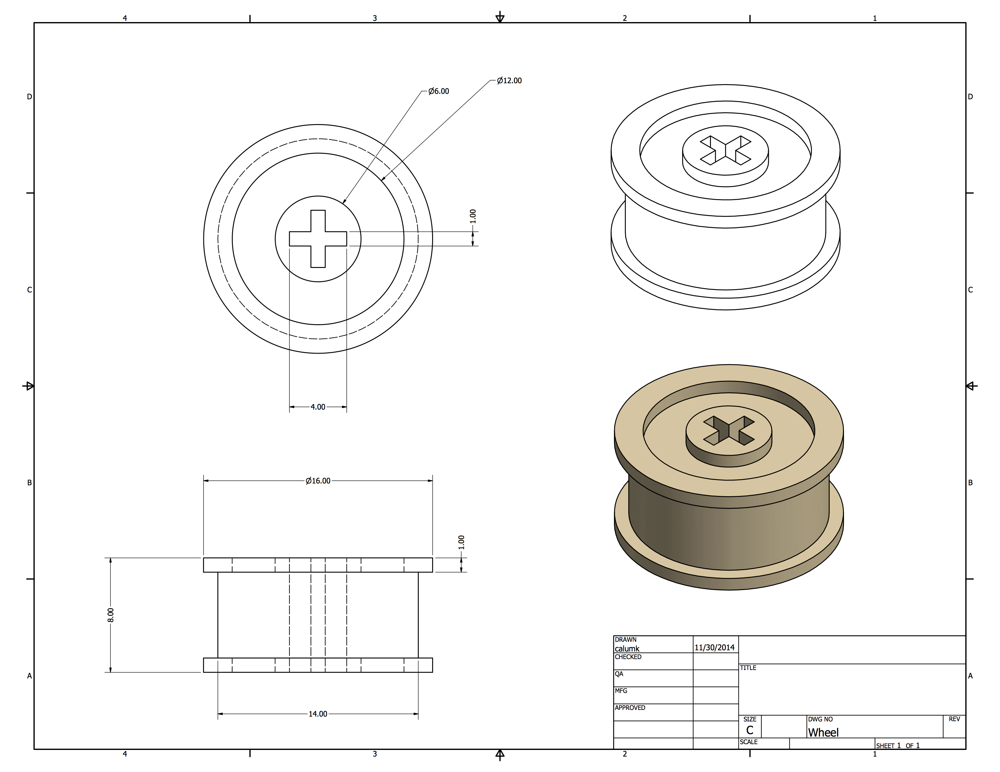
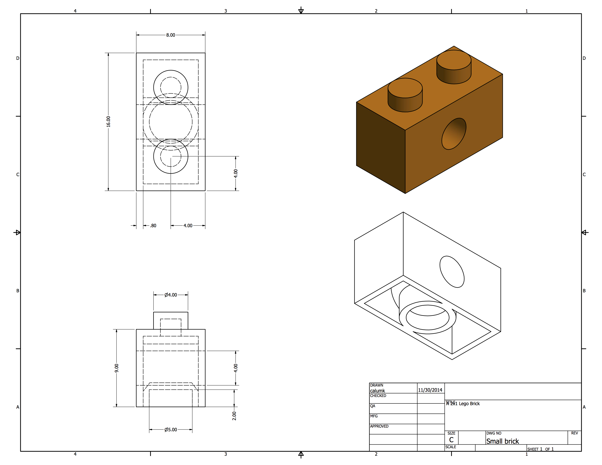
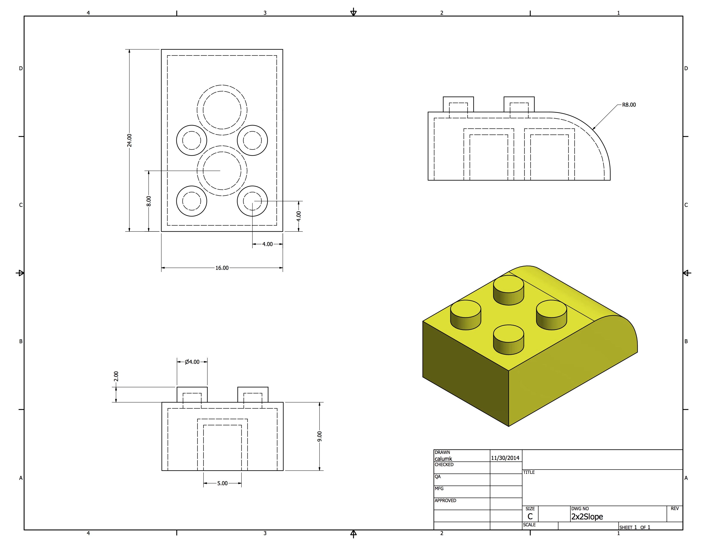
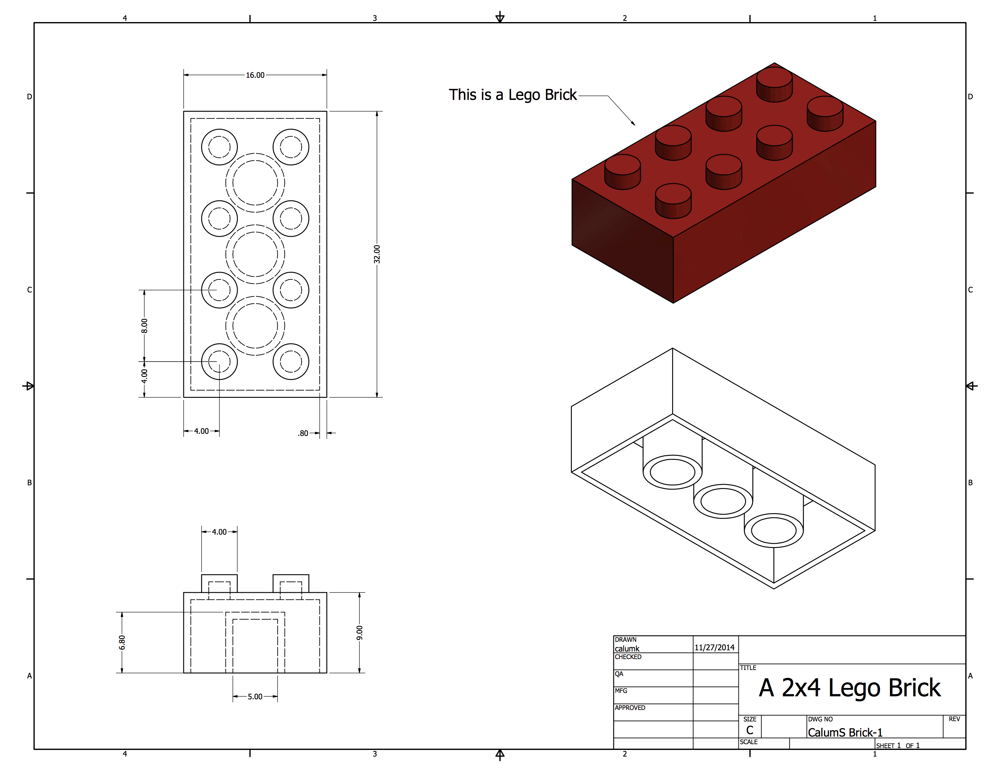

##  And so it begins...

As part of my ongoing work at a London college, I am starting to teach
Autodesk inventor. This post is one of thoes ones that serves really only to
collect some thaughts and hopefully provide someone with a usefull index of
information for the future. A small confession, before beginning to teach the
software, I had used it exactly once. Its easy to pick up. In the past I have
used Blender and more importantly Solidworks, and found the transition very
simple.

##  Tutorials

###  Modeling

Some excelent tutorials can be found care of [ Mr Brunelle's website.
](http://mrbrunelle.org/3_d_modelling.htm) They teach very thouraghly step by
step how to setup and use autocad. I would note that if teaching a beginners
class, It may be wise to skil the tutorial steps invoving seting up projects
and workspaces. My experiance tends to be the quicker you get something "3D"
on the screen, the more you will keep the attention of the class. I decided
that Lego was a good way to go when teaching Inventor basics. It allows you to
explore many of the features, extrudes, cuts, shells, fillets, and the
measurements are easy to remember (basically everything is a multiple of 4mm)
I drew 3 or 4 measurements into inventor, and then created design drawings for
them. 

*  
*  
*  
*  

From the design drawings, I asked the class to
model each block into the software. The final goal will be for them to
assemble a basic lego car.

###  Drawing

I only actually followed one drawing tutorial, a very helpfull [youtube video
](https://www.youtube.com/watch?v=pYrPWfaaPLA) From there, I simply gave a
live demo of these features, and got the class to produce drawings of the Lego
Bricks I had previously got them to model. More to follow, stay tuned :)

