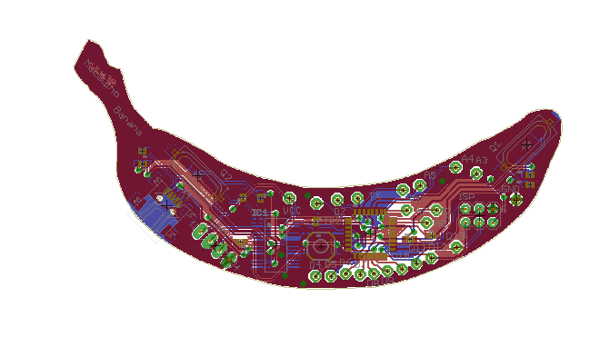

##They say immitation is the greatest form of flattery...

It seems somebody has taken it upon themselves to copy my idea....
Trace it infact.

<blockquote class="twitter-tweet" lang="en">
<a href="https://twitter.com/muccc">@muccc</a> I see you liked my idea for <a href="https://twitter.com/hashtag/wtfduino?src=hash">#wtfduino</a>... and have copied it exactly.... I mean... literally traced it. &#10;<a href="https://twitter.com/hashtag/copycats?src=hash">#copycats</a> <a href="https://twitter.com/hashtag/thisMeansWar?src=hash">#thisMeansWar</a>
&mdash; Calum Knott (@Calumk) <a href="https://twitter.com/Calumk/status/622846899347959808">July 19, 2015</a></blockquote>

###Oh well, such is life.